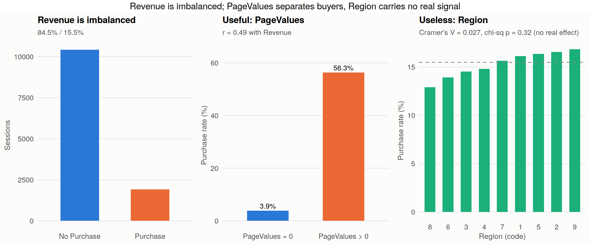
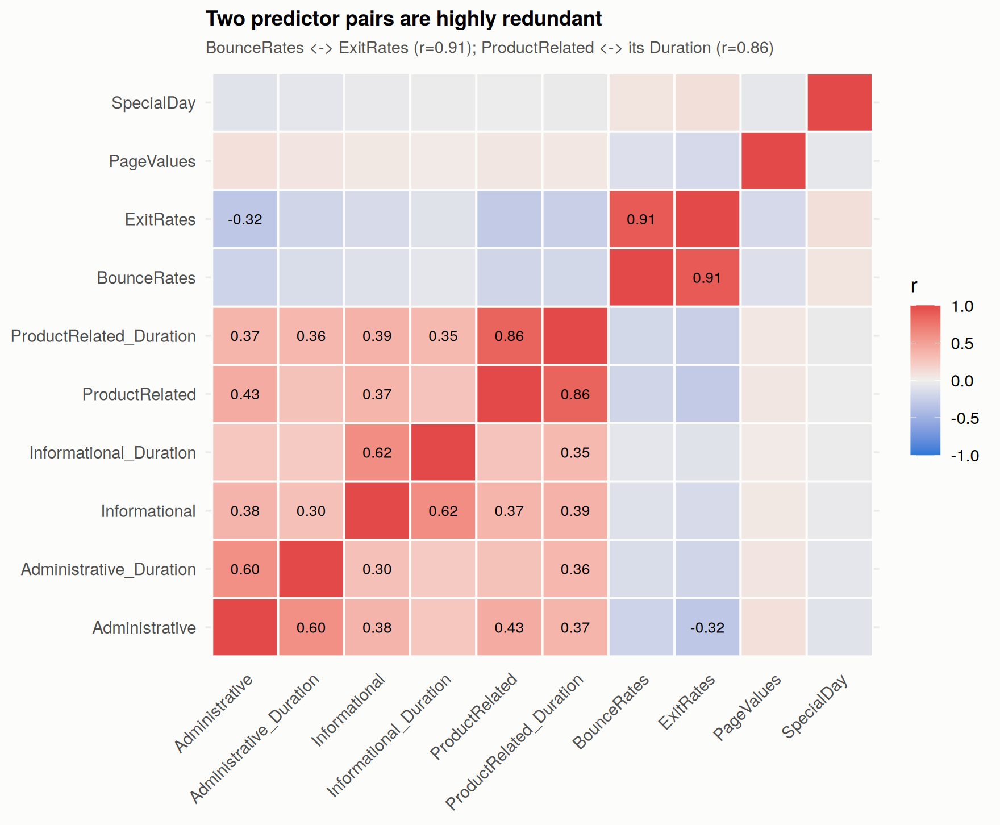
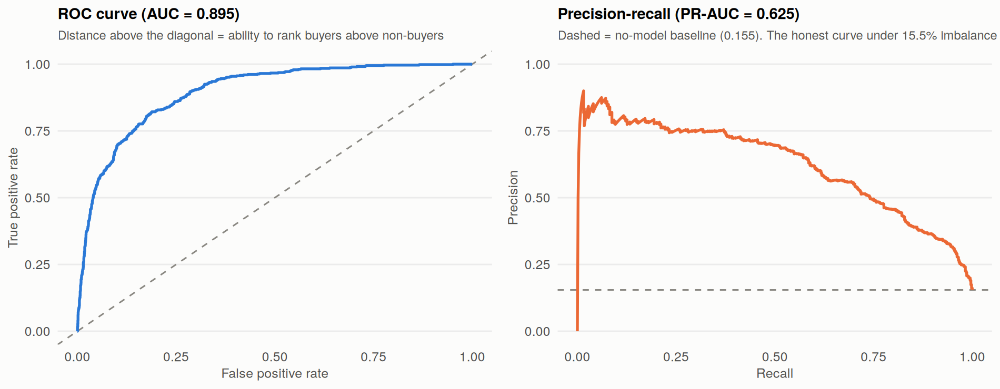
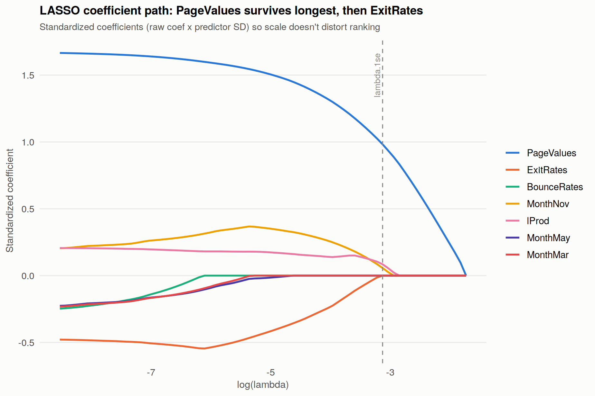

# What Makes an Online Shopper Buy? 🛒

An interactive R Shiny companion app for a statistical analysis of the [UCI Online Shoppers Purchasing Intention dataset](https://archive.ics.uci.edu/dataset/468/online+shoppers+purchasing+intention+dataset) — rebuilding all three project models **live**, from the same data, formulas, and random seed used in the written report, so every number in the app matches the write-up exactly.

> Built for the Advanced Analytics group project. Explore the data, tune model thresholds, watch LASSO's coefficient path in real time, and simulate a browsing session to see all three methods make a live prediction.

---

## Preview

| Class imbalance & the strongest raw signal | Correlation structure across predictors |
|---|---|
|  |  |

| Method 2 — ROC & Precision-Recall | Method 3 — LASSO coefficient path |
|---|---|
|  |  |

*(These four charts are drawn directly from the underlying analysis — the app renders the same numbers live and interactively, with sliders and dropdowns instead of a static image.)*

---

## The business questions

Online stores get plenty of traffic, but very few visits convert. This project — and this app — breaks that question into three smaller ones, each answered with a different statistical method:

| # | Question | Outcome type | Method |
|---|---|---|---|
| **BQ1** | What browsing behaviour lowers a visitor's exit rate? | Continuous | Multiple Linear Regression |
| **BQ2** | Does that behaviour predict an actual purchase? *(the core question)* | Binary | Logistic Regression |
| **BQ3** | Does an unbiased, automatic selector agree with the variables we picked by hand? | Variable selection | LASSO-Regularized Logistic Regression |

Method 1 finds what lowers friction while a visitor browses. Method 2 checks whether that same friction signal predicts an actual sale. Method 3 audits every judgment call made along the way, using every available signal with zero human input.

---

## The dataset

- **12,330 browsing sessions**, one row per visitor, one full year, zero missing values
- **18 raw features** across four families: browsing volume (page counts & durations), page-quality metrics (BounceRates, ExitRates, PageValues), context (SpecialDay, Month, Weekend), and visitor/technical details (OperatingSystems, Browser, Region, TrafficType, VisitorType)
- **Target — `Revenue`**: 84.5% no purchase, 15.5% purchase (a meaningfully imbalanced outcome)
- 10 of 12 months present — January and April are absent from the source data, undocumented

---

## What's inside the app

| Tab | What you can do |
|---|---|
| **Welcome** | Dataset overview, the three business questions, team credits |
| **Explore the Data** | Pick any categorical variable and watch its purchase-rate chart *and* one-way ANOVA/η² result update live; correlation heatmap; descriptive stats |
| **Method 1: MLR** | Sliders to simulate a browsing session and see the predicted exit rate update instantly; standardized coefficient plot; AIC/BIC readout |
| **Method 2: Logistic Regression** | Drag a classification threshold and watch the confusion matrix, accuracy, precision, recall, and F1 recompute live on the same 30% holdout used in the report, alongside ROC and PR curves |
| **Method 3: LASSO** | Drag a penalty-strength slider through glmnet's own λ-ladder and watch predictors shrink to exactly zero one at a time, landing on the report's 3-predictor model at λ ≈ 0.044 |
| **Try It Yourself** | Describe a hypothetical session and get a live predicted exit rate (Method 1) → predicted purchase probability (Method 2) → compared against Method 3's lean 3-variable model, side by side |
| **Summary** | The final side-by-side comparison table from the report |

Every model is fit **once**, when the app starts (not on every click), so every slider and dropdown feels instant.

---

## Results at a glance

| | Method 1 · MLR | Method 2 · Logistic | Method 3 · LASSO |
|---|---|---|---|
| Answers | BQ1 | BQ2 (core) | BQ3 |
| Predictors used | 16 | 18 | **3** (of 49 candidates) |
| Fit | R² = 0.493 | ROC-AUC = 0.895 | ROC-AUC = **0.900** |
| Key finding | Product-page depth is the strongest lever on friction | PageValues + ExitRates drive most of the predictive power | An unbiased selector independently confirms PageValues, product-page views, and a November effect |

---

## Tech stack

`shiny` · `shinythemes` · `ggplot2` · `dplyr` · `glmnet` · `DT` · `plotly` · `scales` · `reshape2`

---

## Running it locally

1. Install R (4.0+) and RStudio.
2. Clone this repo (or download it as a ZIP) and open `app.R` — keep `online_shoppers_intention.csv` in the same folder.
3. Install the required packages once:

```r
   install.packages(c("shiny", "shinythemes", "ggplot2", "dplyr",
                       "glmnet", "DT", "plotly", "scales", "reshape2"))
```

4. Run it:

```r
   shiny::runApp("app.R")
```

The app opens in a browser window or the RStudio Viewer pane.

> **Windows note:** if you see an "Application Control policy has blocked this file" error, it's a local security policy blocking package DLLs from running out of a Temp folder — move the extracted project folder somewhere outside `%TEMP%` (e.g. your Documents folder) and re-run, or just use the hosted deployment below instead.

---

## Deploying so anyone can open it — no local R required

The easiest option is [shinyapps.io](https://www.shinyapps.io) (free tier available):

```r
install.packages("rsconnect")

# Paste the exact command from your shinyapps.io Account → Tokens page:
rsconnect::setAccountInfo(name = "<your-account-name>", token = "<token>", secret = "<secret>")

rsconnect::deployApp("path/to/this/repo")
```

This gives you a public URL (`https://<your-account-name>.shinyapps.io/<app-name>/`) you can drop into a slide or share directly — no local R installation needed on the viewer's end. The free tier sleeps the app after a period of inactivity, so open the link yourself a minute before presenting to warm it up.

---

## Repository structure

```
.
├── app.R                          # the Shiny app
├── online_shoppers_intention.csv  # dataset (must stay alongside app.R)
├── images/                        # figures used in this README
└── README.md
```

---

## Notes

- Model fitting happens once on startup, not per interaction — sliders and dropdowns respond instantly.
- The `glm.fit: fitted probabilities numerically 0 or 1 occurred` message that may appear in the R console on startup is expected — it comes from PageValues and ExitRates being very strong predictors, is already noted in the written report, and does not affect the app's behaviour.
- All three models use the **same seed (42)** and the **same 70/30 stratified train/test split** as the written report, so every number here is directly reproducible against it.

---

## Credits

Advanced Analytics Group Project — built on the UCI Online Shoppers Purchasing Intention Dataset ([Sakar et al., 2019](https://archive.ics.uci.edu/dataset/468/online+shoppers+purchasing+intention+dataset)).

---

## Co-created with
Ashish Ranjan, Sudarshan S, Vibhu Verma, Divyansh S
(Class of 2026–27, IIM Udaipur)
